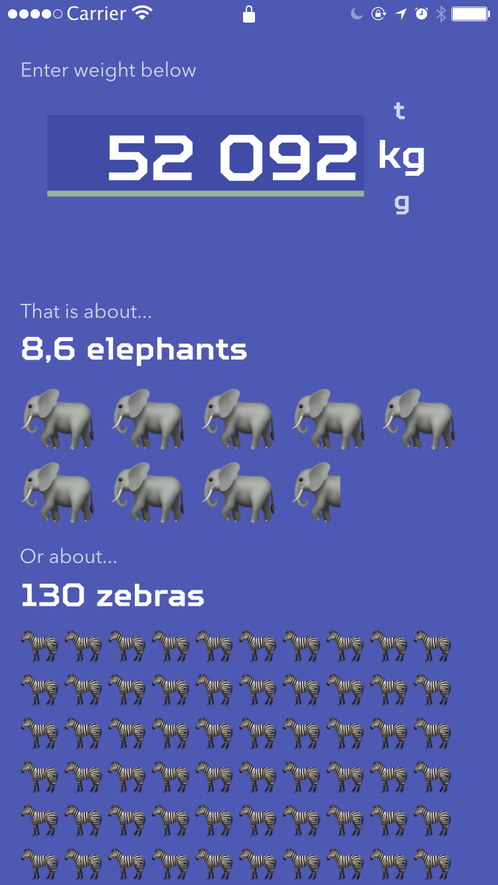

# Animal Units Converter/Calculator

### Metric or imperial units are boring. Why not use 🐘 or maybe 🦓 to represent weight? And what about trees big as 🦒🦒🦒?

Below is concept created in Affinity Designer for weight. It should be semi-accurate because I "researched" how much does 🐘 or 🦓 weigh..

I wanted to include 🦖 but could not find reliable data about its weight 🙃

