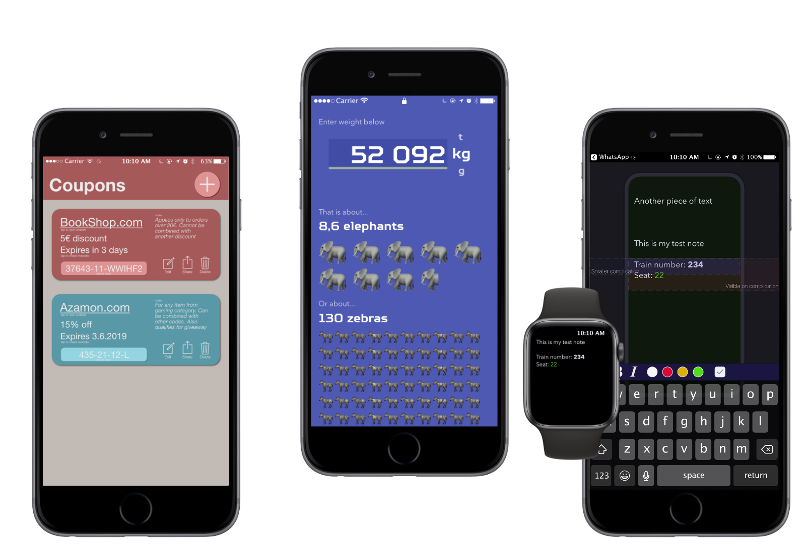

  <a href="https://github.com/nemecek-filip/DynamicType-ReferenceApp">Dynamic Type</a> &bull;
  <a href="https://github.com/nemecek-filip/EKEventKit.Example">Event Kit</a> &bull;
  <a href="https://github.com/nemecek-filip/QLPreviewController.Example">Quick Look</a>  	&bull;
  <b>App Ideas</b>

----
# App Ideas

### Collection of ideas for iOS apps that I don't plan to build (probably)..

--- 

# Welcome

I created this repository because I have more ideas for iOS apps than I have time and appetite to execute on them and bring them to AppStore. So I decided to at least share those.

Some ideas are purely textual, for some I created simple concept images which are included. Some ideas are likely very bad and don't make sense or are already implemented.

**Feel free to use any idea, concept** to create new app and launch it in the AppStore. No attribution required, however I would love to see how the ideas look as finished app.

Get in touch on Twitter - [@nemecek_f](https://twitter.com/nemecek_f) to discuss ideas below, some other ideas or just chat :-)

--- 

## Ideas (so far)

_Hope to add more in the future_

- **[Animal Units Converter](Animal-Units-Converter.md)** _[concept image]_ - convert weight to 🐘, 🦓 and more

- [Auto Meme with Vision](Auto-Meme-with-Vision.md) - use powerful `Vision` framework to streamline the meme process

- [Coupons tracker](Coupons-tracker.md) _[concept image]_ - track all discount coupons with useful features

- [Image Compressor for sharing](Image-Compressor-for-Sharing.md) - allow users to quickly compress image before sending to save data plan

- [Sharing photos to Apple TV](Image-Sharing-to-Apple-TV.md) - let users easily share photos to Apple TV, the current AirPlay solution in iOS is cumbersome

- **[Timelapse from photos](Loong-timelapse.md)**  _[concept image]_ - let user create video timelapse from pictures so the timelapse isnt constrained to single recording

- [Timezone based reminders](Timezone-reminders.md) - for better remote work experience

- [Tooth Watch](Tooth-Watch.md) - watchOS app for better teeth brushing

- [Trip Helper](Trip-helper.md) - never forget stuff to pack for travel

- [Watch Notes](Watch-Notes.md) _[concept image]_ - important notes always on your wrist

---

---
## Looong timelapse

