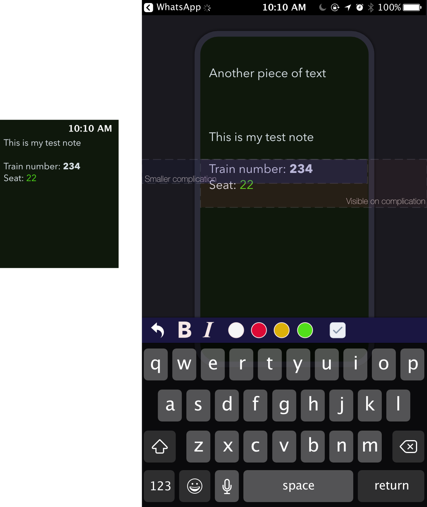

# Watch Notes - small bits of text always at ready

Imagine a situation you have some data that you need to have readily available maybe for a day or two. Like you train number, reserved seat or anything else.

With this app you could quickly transfer this text to you Apple Watch and it would always be at most a tap away without looking for phone.

User would see how much can fit on Watch screen without the need to scroll and also what can be shown on complication...

**Challenge**: AFAIK there is no simple way to show formatted text on Watch. Best way I found is to format text in iOS app by lines and then re-construct it on Watch with labels..

